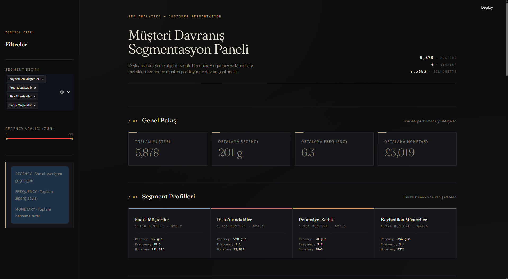
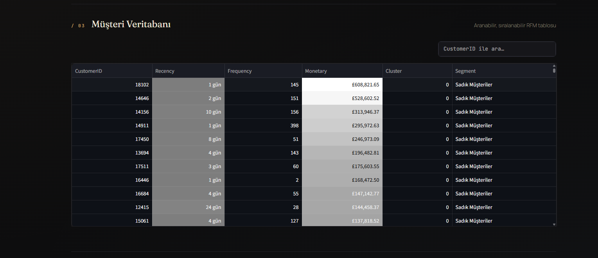
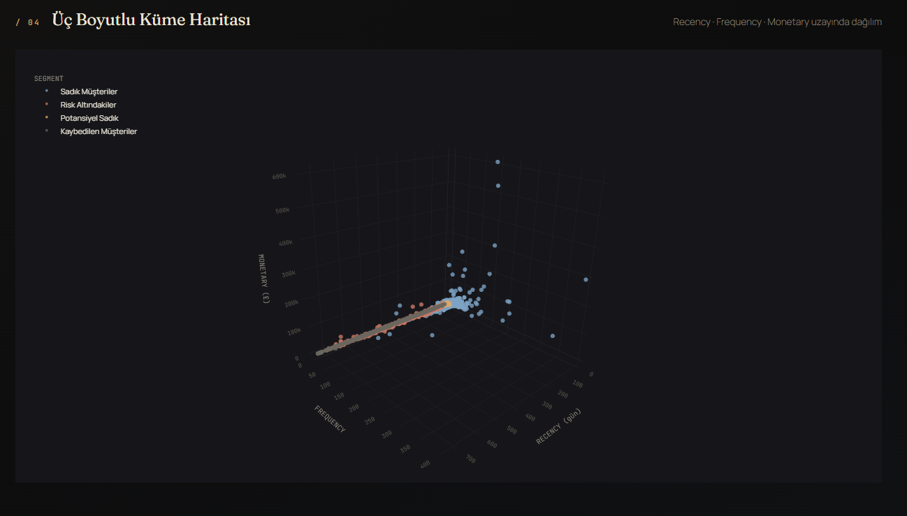
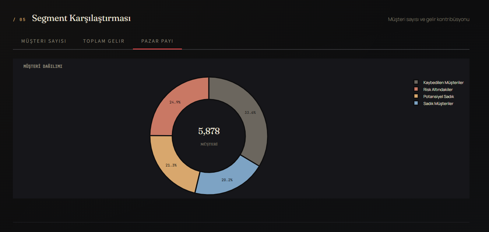
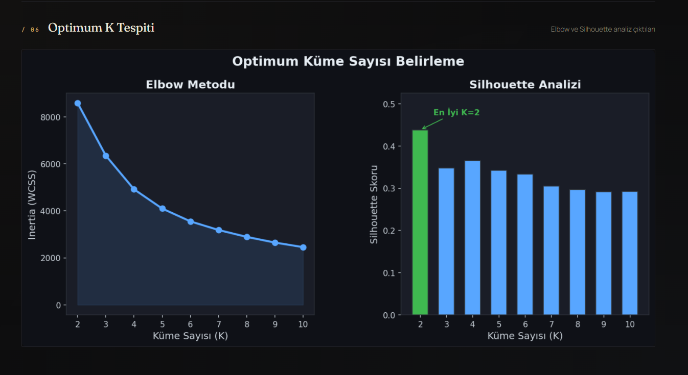

# RFM Müşteri Segmentasyon Analizi

 K-Means kümeleme algoritması ile e-ticaret müşterilerini Recency, Frequency ve
Monetary metrikleri üzerinden davranışsal segmentlere ayıran uçtan uca bir veri
bilimi projesi. Online Retail II veri seti üzerinde 5.800+ müşteriyi analiz eder
ve sonuçları interaktif bir Streamlit panelinde sunar.



---

## İçindekiler

- [Genel Bakış](#genel-bakış)
- [RFM Analizi Nedir?](#rfm-analizi-nedir)
- [Dashboard](#dashboard)
- [Proje Yapısı](#proje-yapısı)
- [Kullanılan Teknolojiler](#kullanılan-teknolojiler)
- [Kurulum](#kurulum)
- [Çalıştırma](#çalıştırma)
- [Metodoloji](#metodoloji)
- [Sonuçlar](#sonuçlar)
- [Lisans](#lisans)

---

## Genel Bakış

 Bu proje, ham fatura kayıtlarından başlayarak iş açısından anlamlı müşteri
segmentlerine ulaşan tam bir analitik boru hattı sunar. Pipeline üç ana aşamadan
oluşur:

1. **Veri Hazırlığı** — Hatalı kayıtlar temizlenir, RFM metrikleri hesaplanır
2. **Modelleme** — Log dönüşümü ve StandardScaler sonrası K-Means uygulanır
3. **Görselleştirme** — Streamlit + Plotly ile etkileşimli panel

Hedef kitle e-ticaret işletmeleri, CRM ekipleri ve veri bilimi adaylarıdır.

---

## RFM Analizi Nedir?

RFM, müşteri değerini üç temel metrik üzerinden ölçen bir davranışsal
segmentasyon yöntemidir:

| Metrik | Soru | Yorum |
|---|---|---|
| **Recency** | Müşteri en son ne zaman alışveriş yaptı? | Düşük değer iyidir |
| **Frequency** | Toplam kaç kez alışveriş yaptı? | Yüksek değer iyidir |
| **Monetary** | Toplam ne kadar para harcadı? | Yüksek değer iyidir |

Bu üç metrik bir araya getirildiğinde müşteriler aşağıdaki gibi gruplara ayrılır:

- **Şampiyonlar** — Yakın zamanda, sık sık ve çok harcayan en değerli grup
- **Sadık Müşteriler** — Düzenli ve yüksek hacimli alışveriş yapanlar
- **Potansiyel Sadık** — Yeni başlamış, gelecek vaat eden müşteriler
- **Risk Altındakiler** — Eskiden değerliyken uzaklaşmaya başlayanlar
- **Kaybedilen Müşteriler** — Uzun süredir geri dönmeyenler

---

## Dashboard

Streamlit ile geliştirilmiş interaktif panel, analizin tüm aşamalarını altı bölümde sunar.

### Müşteri Veritabanı

Tüm müşterilerin RFM metrikleri ile birlikte aranabilir, sıralanabilir tablo. Monetary ve Recency sütunları kademeli renklendirme ile vurgulanır.



### Üç Boyutlu Küme Haritası

Plotly ile geliştirilmiş etkileşimli 3 boyutlu scatter plot. Eksenler Recency, Frequency ve Monetary; noktalar segmentlere göre renklendirilmiştir.



### Müşteri Dağılımı

Segmentlerin müşteri sayısı bazında pazar payı dağılımı.



### Optimum K Tespiti

Elbow ve Silhouette analizleri ile küme sayısının veriye göre belirlenmesi.



---

## Proje Yapısı

```
rfm_project/
├── data/
│   ├── online_retail_II.xlsx     # Ham veri seti (UCI / Kaggle)
│   ├── cleaned_data.csv          # Temizlenmiş veri (otomatik)
│   ├── rfm_data.csv              # RFM metrikleri (otomatik)
│   └── rfm_clustered.csv         # Küme etiketli RFM (otomatik)
│
├── assets/
│   └── elbow_plot.png            # Elbow ve Silhouette analizi
│
├── screenshots/                  # README görselleri
├── preprocessing.py              # Adım 1-2: Temizleme + RFM
├── clustering.py                 # Adım 3: K-Means + değerlendirme
├── app.py                        # Adım 4: Streamlit Dashboard
├── requirements.txt
└── README.md
```

---

## Kullanılan Teknolojiler

| Katman | Araç |
|---|---|
| Veri İşleme | pandas, numpy |
| Makine Öğrenimi | scikit-learn (KMeans, StandardScaler, silhouette_score) |
| Görselleştirme | matplotlib, plotly |
| Dashboard | streamlit |
| Excel Desteği | openpyxl |
| Dil | Python 3.10+ |

---

## Kurulum

### 1. Depoyu klonlayın

```bash
git clone https://github.com/bisraunal/rfm-segmentation.git
cd rfm-segmentation
```

### 2. Sanal ortam oluşturun

```bash
python -m venv .venv

# Linux / macOS
source .venv/bin/activate

# Windows (PowerShell)
.venv\Scripts\Activate.ps1
```

### 3. Bağımlılıkları yükleyin

```bash
pip install -r requirements.txt
```

### 4. Veri setini yerleştirin

`online_retail_II.xlsx` dosyasını `data/` klasörüne kopyalayın. Veri seti
[UCI Machine Learning Repository](https://archive.ics.uci.edu/dataset/502/online+retail+ii)
üzerinden ücretsiz indirilebilir.

Beklenen sütunlar (Online Retail II'nin orijinal yapısı otomatik tanınır):

| Sütun | Açıklama |
|---|---|
| Invoice / InvoiceNo | Fatura numarası |
| StockCode | Ürün kodu |
| Quantity | Satış adedi |
| InvoiceDate | Fatura tarihi |
| Price / UnitPrice | Birim fiyat |
| Customer ID / CustomerID | Müşteri kimliği |

> Veri bulunamazsa, test amaçlı 5.000 satırlık örnek veri otomatik üretilir.

---

## Çalıştırma

### Adım adım

```bash
python preprocessing.py    # Temizle, RFM hesapla
python clustering.py       # K-Means kümeleme
streamlit run app.py       # Dashboard
```

### Tek komut

```bash
streamlit run app.py
```

Dashboard ilk açılışta pipeline'ı otomatik tetikler. Tarayıcıda
`http://localhost:8501` adresine gidin.

---

## Metodoloji

### Veri Temizleme

- `CustomerID` eksik olan satırlar (~243.000 kayıt) silinir
- `Quantity` veya `UnitPrice` sıfır/negatif olan satırlar (iadeler, hatalar) çıkarılır
- `TotalAmount = Quantity × UnitPrice` hesaplanır

### RFM Hesaplama

- **Analiz tarihi:** Son fatura tarihi + 1 gün
- **Recency:** Müşterinin son alışverişine kadar geçen gün sayısı
- **Frequency:** Müşterinin benzersiz fatura sayısı
- **Monetary:** Müşterinin toplam harcaması

### Modelleme

- **Log dönüşümü** (`np.log1p`): Online Retail II'de Monetary değerleri
  £2.95 — £608.000 aralığında dağıldığı için ham değerlerle K-Means yalnızca
  birkaç outlier'ı ayırır. Log dönüşümü dağılımı normalleştirir.
- **StandardScaler:** Tüm özelliklerin aynı ölçeğe gelmesini sağlar
- **K seçimi:** Silhouette skoru en yüksek olan K (K ≥ 3 kısıtıyla, K=2 yalnızca
  outlier'ları izole ettiği için atlanır)
- **Algoritma:** K-Means++ başlatma, `n_init=10`, `random_state=42`

### Değerlendirme

- **Silhouette skoru:** Kümelerin birbirinden ne kadar ayrıştığını ölçer
  (-1 ile +1 arası, yüksek olması iyidir)
- **Elbow grafiği:** Inertia (within-cluster sum of squares) görsel kontrolü

---

## Sonuçlar

Online Retail II veri setinde tipik çıktı:

| Segment | Müşteri | Recency | Frequency | Monetary |
|---|---:|---:|---:|---:|
| Sadık Müşteriler | ~1.200 | 27 gün | 19 fatura | £11.014 |
| Potansiyel Sadık | ~1.250 | 28 gün | 3 fatura | £865 |
| Risk Altındakiler | ~1.470 | 228 gün | 5 fatura | £2.002 |
| Kaybedilen Müşteriler | ~1.970 | 396 gün | 1 fatura | £326 |

**Silhouette Skoru:** ~0.37 (log dönüşümlü gerçek dünya RFM verisi için iyi)

### İş Yorumları

- Müşterilerin yaklaşık üçte biri kaybedilmiş durumda — geri kazanma kampanyaları
  için hedef kitle
- Risk altındaki segmentin ortalama harcaması yüksek; sadakat programıyla
  kurtarılabilir
- Sadık müşteriler tüm gelirin önemli kısmını oluşturur; VIP programı için ideal

---

## Dashboard Bileşenleri

| Bölüm | Açıklama |
|---|---|
| 01 — Genel Bakış | Toplam müşteri, ortalama R/F/M değerleri |
| 02 — Segment Profilleri | Her segmentin müşteri sayısı ve ortalama metrikleri |
| 03 — Müşteri Veritabanı | Aranabilir, sıralanabilir RFM tablosu |
| 04 — 3D Küme Haritası | Plotly ile etkileşimli 3 boyutlu scatter |
| 05 — Segment Karşılaştırması | Müşteri sayısı, gelir, pazar payı grafikleri |
| 06 — Optimum K Tespiti | Elbow ve Silhouette analiz çıktıları |

---

## Katkıda Bulunma

1. Depoyu fork'layın
2. Yeni bir özellik dalı oluşturun (`git checkout -b feature/yeni-ozellik`)
3. Değişikliklerinizi commit edin (`git commit -m 'feat: aciklama'`)
4. Pull Request gönderin

---

## Lisans

MIT License — projeyi serbestçe kullanabilir, değiştirebilir ve dağıtabilirsiniz.

---

## Referanslar

- Online Retail II Data Set — UCI Machine Learning Repository
- Hughes, Arthur M. (2005). *Strategic Database Marketing*. McGraw-Hill
- scikit-learn dokümantasyonu — KMeans clustering
